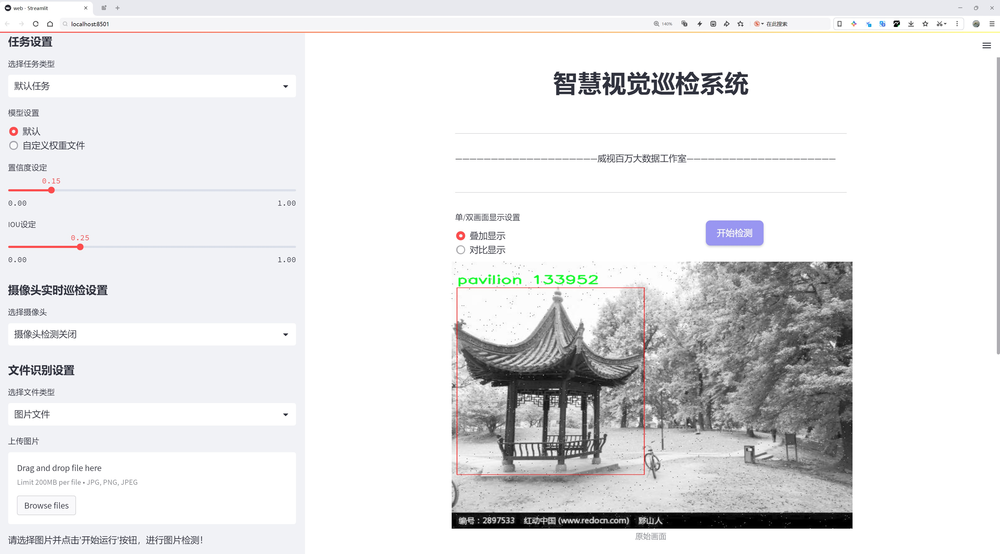
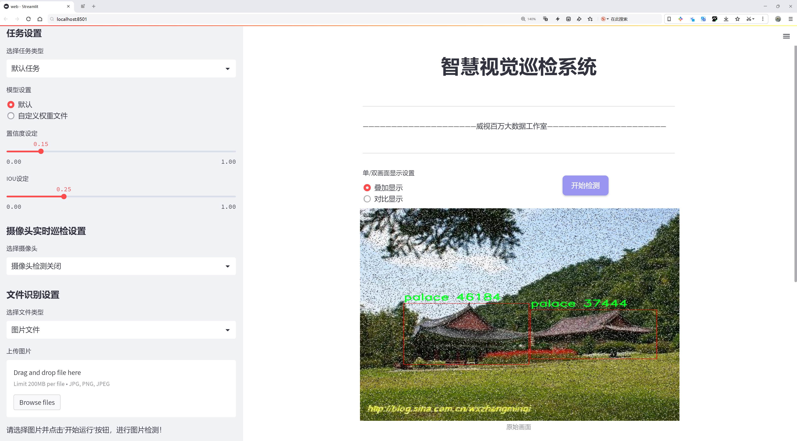
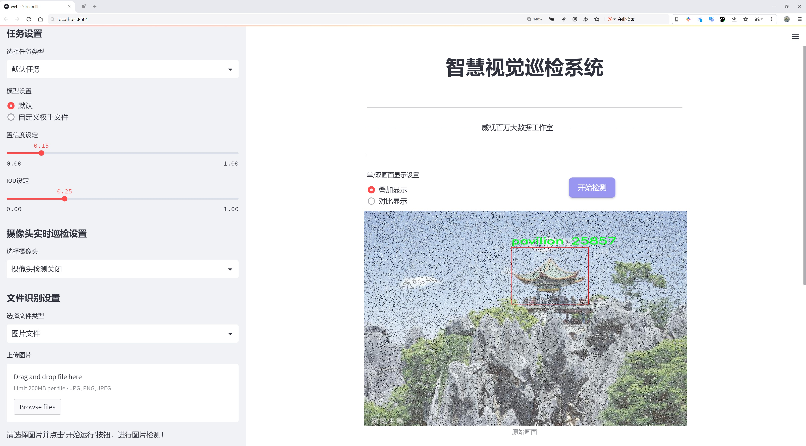
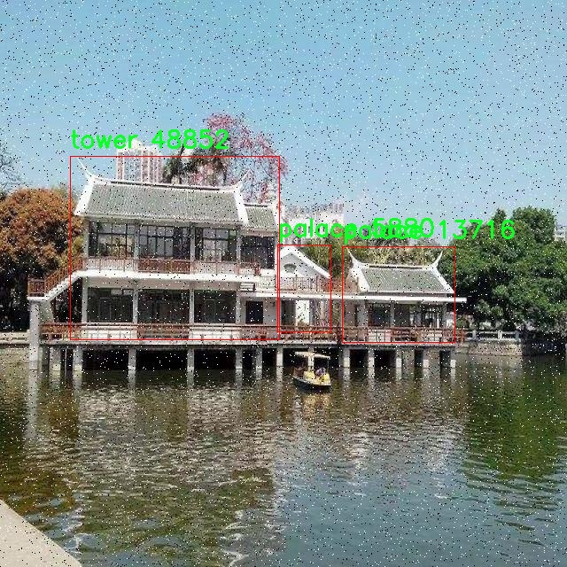
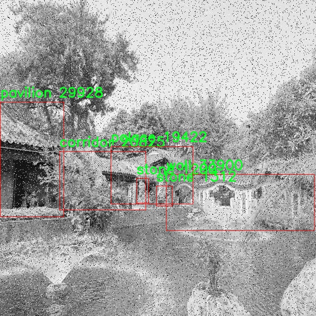
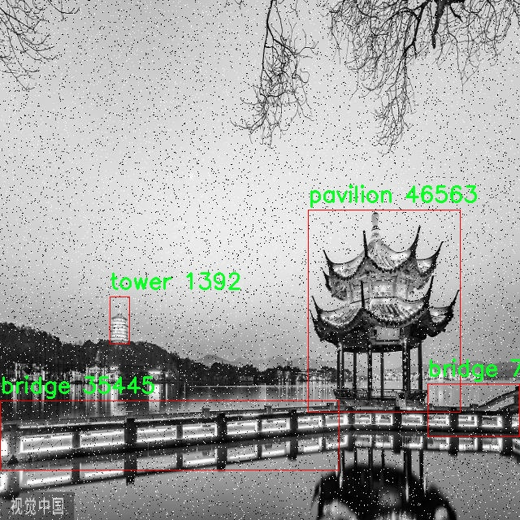
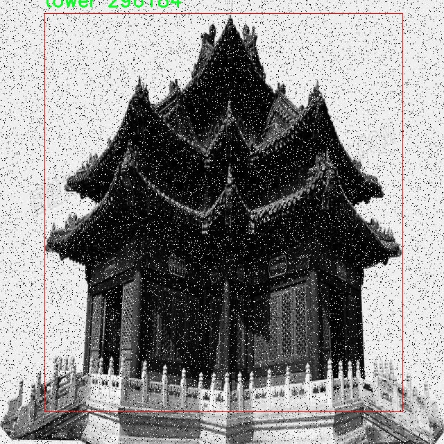
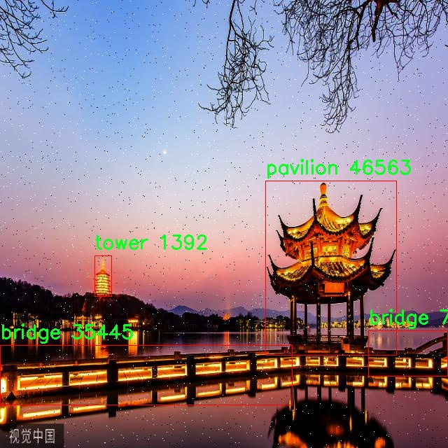

# 园林建筑物类型检测检测系统源码分享
 # [一条龙教学YOLOV8标注好的数据集一键训练_70+全套改进创新点发刊_Web前端展示]

### 1.研究背景与意义

项目参考[AAAI Association for the Advancement of Artificial Intelligence](https://gitee.com/qunshansj/projects)

项目来源[AACV Association for the Advancement of Computer Vision](https://gitee.com/qunmasj/projects)

研究背景与意义

随着城市化进程的加快，园林建筑作为城市景观的重要组成部分，其保护与管理显得尤为重要。园林建筑不仅承载着丰富的文化历史，还在生态环境和城市美学中发挥着不可替代的作用。然而，传统的园林建筑物类型识别方法多依赖人工经验，效率低下且易受主观因素影响，难以满足现代园林管理的需求。因此，基于计算机视觉技术的自动化识别系统应运而生，成为提升园林建筑物管理效率的重要手段。

在众多计算机视觉技术中，目标检测算法因其高效性和准确性受到广泛关注。YOLO（You Only Look Once）系列算法作为一种实时目标检测技术，因其出色的性能和快速的推理速度而被广泛应用于各类物体检测任务。YOLOv8作为该系列的最新版本，结合了深度学习的先进理念和高效的网络结构，具备了更强的特征提取能力和更快的处理速度。然而，针对园林建筑物类型的特定检测需求，YOLOv8仍需进行一定的改进和优化，以适应复杂的园林环境和多样的建筑类型。

本研究旨在基于改进的YOLOv8算法，构建一个高效的园林建筑物类型检测系统。我们使用的“GardenBuildings”数据集包含2272张图像，涵盖了桥、走廊、门、宫殿、亭子、石头、塔和墙等8个类别。这些类别不仅代表了园林建筑的多样性，也反映了园林设计的复杂性和丰富性。通过对这些图像的深入分析和处理，能够有效提取出不同建筑类型的特征，从而提高检测的准确性和鲁棒性。

本研究的意义在于，首先，通过改进YOLOv8算法，提升园林建筑物类型检测的准确性和实时性，为园林管理提供更为高效的技术支持。其次，构建的检测系统能够为园林建筑的数字化管理和智能化监测提供基础数据，促进园林资源的合理利用和可持续发展。此外，研究成果还将为相关领域的研究提供借鉴，推动计算机视觉技术在文化遗产保护、城市规划等领域的应用。

综上所述，基于改进YOLOv8的园林建筑物类型检测系统的研究，不仅具有重要的理论价值，也具备广泛的实际应用前景。通过本研究，我们期望能够为园林建筑的保护与管理提供一种新的思路和方法，推动园林建筑物类型检测技术的发展，为实现智能园林管理贡献力量。

### 2.图片演示







##### 注意：由于此博客编辑较早，上面“2.图片演示”和“3.视频演示”展示的系统图片或者视频可能为老版本，新版本在老版本的基础上升级如下：（实际效果以升级的新版本为准）

  （1）适配了YOLOV8的“目标检测”模型和“实例分割”模型，通过加载相应的权重（.pt）文件即可自适应加载模型。

  （2）支持“图片识别”、“视频识别”、“摄像头实时识别”三种识别模式。

  （3）支持“图片识别”、“视频识别”、“摄像头实时识别”三种识别结果保存导出，解决手动导出（容易卡顿出现爆内存）存在的问题，识别完自动保存结果并导出到tempDir中。

  （4）支持Web前端系统中的标题、背景图等自定义修改，后面提供修改教程。

  另外本项目提供训练的数据集和训练教程,暂不提供权重文件（best.pt）,需要您按照教程进行训练后实现图片演示和Web前端界面演示的效果。

### 3.视频演示

[3.1 视频演示](https://www.bilibili.com/video/BV15ZthekE5w/)

### 4.数据集信息展示

##### 4.1 本项目数据集详细数据（类别数＆类别名）

nc: 8
names: ['bridge', 'corridor', 'door', 'palace', 'pavilion', 'stone', 'tower', 'wall']


##### 4.2 本项目数据集信息介绍

数据集信息展示

在现代园林建筑物类型检测系统的研究中，数据集的构建与选择至关重要。为此，我们引入了名为“GardenBuildings”的数据集，该数据集专门用于训练和改进YOLOv8模型，以实现对园林建筑物类型的精准检测。该数据集的设计充分考虑了园林建筑物的多样性与复杂性，涵盖了八种主要类别，分别为桥梁（bridge）、走廊（corridor）、门（door）、宫殿（palace）、亭子（pavilion）、石材建筑（stone）、塔楼（tower）和墙壁（wall）。这些类别不仅反映了园林建筑的典型特征，还体现了不同文化和历史背景下的建筑风格。

“GardenBuildings”数据集的构建过程经过精心策划，确保了数据的多样性和代表性。数据集中的每一类建筑物均经过严格筛选，确保其在园林环境中的实际应用。桥梁作为连接不同园林区域的重要结构，展现了园林设计中的流动性与美感；走廊则是园林空间中常见的过渡区域，体现了建筑与自然的和谐共生；门作为建筑的入口，承载着空间的转换与情感的交流；宫殿则代表了园林建筑的宏伟与壮丽，常常是园林的视觉中心；亭子则是休憩与观景的理想场所，常见于各类园林设计中；石材建筑则展示了坚固与耐久的特性，常用于园林的基础设施；塔楼则提供了俯瞰园林全景的视角，增加了空间的层次感；墙壁则在园林中起到分隔与保护的作用，塑造了园林的私密性与安全感。

在数据集的标注过程中，采用了高精度的图像标注技术，确保每一类建筑物都能被准确识别和分类。数据集中的图像来自不同的园林环境，涵盖了多种光照条件、季节变化和视角，以增强模型的泛化能力。这种多样化的训练数据使得YOLOv8模型在实际应用中能够更好地适应不同的园林场景，提高了检测的准确性和鲁棒性。

此外，为了进一步提升模型的性能，数据集还包含了大量的背景图像，以帮助模型更好地区分建筑物与周围环境。这种背景信息的引入，不仅增强了模型的学习能力，还提高了其在复杂场景下的检测精度。通过对“GardenBuildings”数据集的深入研究与应用，我们期望能够推动园林建筑物类型检测技术的发展，为智能园林设计与管理提供更为强大的技术支持。

总之，“GardenBuildings”数据集的构建与应用为园林建筑物类型检测提供了丰富的资源与可能性。通过对该数据集的深入挖掘与分析，我们相信可以在YOLOv8模型的基础上，开发出更为先进的园林建筑物检测系统，为园林设计、保护与管理提供更为精准的技术解决方案。











### 5.全套项目环境部署视频教程（零基础手把手教学）

[5.1 环境部署教程链接（零基础手把手教学）](https://www.ixigua.com/7404473917358506534?logTag=c807d0cbc21c0ef59de5)


[5.2 安装Python虚拟环境创建和依赖库安装视频教程链接（零基础手把手教学）](https://www.ixigua.com/7404474678003106304?logTag=1f1041108cd1f708b01a)

### 6.手把手YOLOV8训练视频教程（零基础小白有手就能学会）

[6.1 手把手YOLOV8训练视频教程（零基础小白有手就能学会）](https://www.ixigua.com/7404477157818401292?logTag=d31a2dfd1983c9668658)

### 7.70+种全套YOLOV8创新点代码加载调参视频教程（一键加载写好的改进模型的配置文件）

[7.1 70+种全套YOLOV8创新点代码加载调参视频教程（一键加载写好的改进模型的配置文件）](https://www.ixigua.com/7404478314661806627?logTag=29066f8288e3f4eea3a4)

### 8.70+种全套YOLOV8创新点原理讲解（非科班也可以轻松写刊发刊，V10版本正在科研待更新）

由于篇幅限制，每个创新点的具体原理讲解就不一一展开，具体见下列网址中的创新点对应子项目的技术原理博客网址【Blog】：


[8.1 70+种全套YOLOV8创新点原理讲解链接](https://gitee.com/qunmasj/good)

### 9.系统功能展示（检测对象为举例，实际内容以本项目数据集为准）

图9.1.系统支持检测结果表格显示

  图9.2.系统支持置信度和IOU阈值手动调节

  图9.3.系统支持自定义加载权重文件best.pt(需要你通过步骤5中训练获得)

  图9.4.系统支持摄像头实时识别

  图9.5.系统支持图片识别

  图9.6.系统支持视频识别

  图9.7.系统支持识别结果文件自动保存

  图9.8.系统支持Excel导出检测结果数据


### 10.原始YOLOV8算法原理

原始YOLOv8算法原理

YOLOv8作为YOLO系列中的最新一员，于2023年1月由Ultralytics发布，标志着目标检测技术的又一次重要进步。该算法不仅延续了YOLO系列一贯的高效性和实时性，还在多个方面进行了创新和优化，使其在目标检测领域中脱颖而出。YOLOv8的设计理念基于对前几代YOLO模型的深入分析与改进，特别是结合了YOLOX、YOLOv6、YOLOv7和PPYOLOE等算法的优点，形成了一种更加灵活和高效的检测框架。

首先，YOLOv8的模型结构由三个主要部分组成：输入端、主干网络和检测端。不同于以往的YOLO模型，YOLOv8提供了五种不同尺度的模型，分别为n、s、m、l和x，以满足不同应用场景的需求。这种设计不仅考虑了模型的深度和特征图宽度，还通过调整主干网络的通道数来优化模型性能。以YOLOv8n为例，其网络结构经过精心设计，采用了更轻量化的C2f模块来替代传统的C3模块，从而在保持模型轻量化的同时，增强了网络的表达能力和梯度信息的丰富性。

在YOLOv8的主干网络中，依然采用了PAN-FPN（路径聚合网络-特征金字塔网络）的结构，但对上采样部分的卷积结构进行了删减。这一改进使得特征融合更加高效，尤其是在处理多尺度特征时，能够更好地捕捉到目标的细节信息。C2f模块的引入，基于CSPBottleneck with 3 convolutions（C3）模块和ELAN模块的设计理念，增强了网络的残差连接，使得信息在网络中的流动更加顺畅，从而提升了模型的学习能力。

YOLOv8在检测头部分的创新同样值得关注。与传统的耦合头结构不同，YOLOv8采用了流行的解耦合头结构，将分类和检测任务分开处理。这种设计不仅提高了模型的灵活性，还使得模型在处理复杂场景时能够更好地进行目标分类和定位。此外，YOLOv8还将Anchor-Based方法替换为Anchor-Free方法，进一步简化了模型的设计，降低了计算复杂度，同时提升了检测精度。

在训练过程中，YOLOv8引入了一些新的数据增强策略。例如，在训练的最后10个epoch中关闭马赛克增强，并采用动态Task-Aligned Assigner样本分配策略。这些策略的实施，使得模型在训练过程中能够更好地适应不同的目标特征，提高了模型的泛化能力和鲁棒性。同时，YOLOv8在损失计算方面也进行了优化，使用BCELoss作为分类损失，DFLLoss和CIoULoss作为回归损失，这种组合使得模型在目标检测任务中能够更有效地学习到目标的特征。

YOLOv8的设计不仅注重模型的精度和速度，还强调了轻量化的实现。轻量化YOLOv8n目标检测模型通过在骨干特征提取网络层使用C2F模块替代C3模块，进一步减少了模型的计算量和参数量。特征融合网络中引入BiFPN网络，旨在提高模型对不同尺度特征信息的提取速度。BiFPN的核心思想是高效的双向跨尺度连接和加权特征融合，这一设计极大地提升了模型在处理多尺度目标时的能力。

总的来说，YOLOv8通过一系列的创新与优化，成功地将目标检测技术推向了一个新的高度。其高精度和快速响应的特性，使得YOLOv8在实际应用中展现出广泛的前景。例如，在农业领域，YOLOv8可以被应用于苹果采摘的视觉识别，自动检测和定位苹果，极大地提高了采摘效率。此外，结合蚁群算法进行路径规划，使得自动采摘机器人能够在复杂环境中快速完成任务，展现了YOLOv8在智能农业中的应用潜力。

综上所述，YOLOv8不仅是YOLO系列的延续，更是对目标检测技术的一次全面革新。通过对模型结构的优化、训练策略的改进以及损失函数的创新，YOLOv8在目标检测领域中实现了更高的精度和更快的速度，成为了实时检测技术的新标杆。随着YOLOv8的不断发展与应用，未来的目标检测将会更加智能化和高效化，为各行各业带来深远的影响。


### 11.项目核心源码讲解（再也不用担心看不懂代码逻辑）

#### 11.1 code\ultralytics\utils\checks.py

以下是对代码中最核心部分的分析和详细中文注释。代码主要涉及依赖检查、版本管理、文件处理等功能，以下是精简后的核心部分：

```python
import os
import re
import subprocess
from pathlib import Path
from typing import List, Dict, Optional
from importlib import metadata
import torch
from ultralytics.utils import LOGGER, ROOT, USER_CONFIG_DIR, downloads

def parse_requirements(file_path=ROOT.parent / "requirements.txt", package="") -> List[Dict[str, str]]:
    """
    解析 requirements.txt 文件，忽略以 '#' 开头的行和 '#' 后的文本。

    参数:
        file_path (Path): requirements.txt 文件的路径。
        package (str, optional): 要使用的 Python 包名。

    返回:
        List[Dict[str, str]]: 解析后的需求列表，每个需求为字典形式，包含 `name` 和 `specifier` 键。
    """
    if package:
        requires = [x for x in metadata.distribution(package).requires if "extra == " not in x]
    else:
        requires = Path(file_path).read_text().splitlines()

    requirements = []
    for line in requires:
        line = line.strip()
        if line and not line.startswith("#"):
            line = line.split("#")[0].strip()  # 忽略行内注释
            match = re.match(r"([a-zA-Z0-9-_]+)\s*([<>!=~]+.*)?", line)
            if match:
                requirements.append({"name": match[1], "specifier": match[2].strip() if match[2] else ""})

    return requirements


def check_version(current: str, required: str, name: str = "version", hard: bool = False) -> bool:
    """
    检查当前版本是否满足所需版本或范围。

    参数:
        current (str): 当前版本或包名。
        required (str): 所需版本或范围（pip 风格格式）。
        name (str, optional): 用于警告消息的名称。
        hard (bool, optional): 如果为 True，当要求不满足时抛出 AssertionError。

    返回:
        bool: 如果满足要求则返回 True，否则返回 False。
    """
    if not current:
        LOGGER.warning(f"WARNING ⚠️ invalid check_version({current}, {required}) requested, please check values.")
        return True

    op = ""
    version = ""
    result = True
    c = parse_version(current)  # 将版本字符串转换为元组

    for r in required.strip(",").split(","):
        op, version = re.match(r"([^0-9]*)([\d.]+)", r).groups()  # 分离操作符和版本号
        v = parse_version(version)  # 将版本字符串转换为元组
        if op == "==" and c != v:
            result = False
        elif op == "!=" and c == v:
            result = False
        elif op in (">=", "") and not (c >= v):
            result = False
        elif op == "<=" and not (c <= v):
            result = False
        elif op == ">" and not (c > v):
            result = False
        elif op == "<" and not (c < v):
            result = False

    if not result:
        warning = f"WARNING ⚠️ {name}{op}{version} is required, but {name}=={current} is currently installed."
        if hard:
            raise ModuleNotFoundError(warning)  # 抛出异常
        LOGGER.warning(warning)
    return result


def check_requirements(requirements=ROOT.parent / "requirements.txt", exclude=(), install=True) -> bool:
    """
    检查已安装的依赖项是否满足要求，并尝试自动更新。

    参数:
        requirements (Union[Path, str, List[str]]): requirements.txt 文件的路径，单个包要求或包要求列表。
        exclude (Tuple[str]): 要排除的包名元组。
        install (bool): 如果为 True，尝试自动更新不满足要求的包。

    返回:
        bool: 如果所有要求都满足则返回 True，否则返回 False。
    """
    check_python()  # 检查 Python 版本
    if isinstance(requirements, Path):  # requirements.txt 文件
        file = requirements.resolve()
        assert file.exists(), f"requirements file {file} not found."
        requirements = [f"{x['name']}{x['specifier']}" for x in parse_requirements(file) if x['name'] not in exclude]
    elif isinstance(requirements, str):
        requirements = [requirements]

    pkgs = []
    for r in requirements:
        match = re.match(r"([a-zA-Z0-9-_]+)([<>!=~]+.*)?", r)
        name, required = match[1], match[2].strip() if match[2] else ""
        try:
            assert check_version(metadata.version(name), required)  # 检查版本
        except (AssertionError, metadata.PackageNotFoundError):
            pkgs.append(r)

    if pkgs and install:
        n = len(pkgs)
        LOGGER.info(f"Ultralytics requirements {pkgs} not found, attempting AutoUpdate...")
        try:
            subprocess.check_output(f"pip install --no-cache {' '.join(pkgs)}", shell=True)
            LOGGER.info(f"AutoUpdate success, installed {n} packages: {pkgs}")
        except Exception as e:
            LOGGER.warning(f"AutoUpdate failed: {e}")
            return False

    return True


def check_python(minimum: str = "3.8.0") -> bool:
    """
    检查当前 Python 版本是否满足最低要求。

    参数:
        minimum (str): 所需的最低 Python 版本。

    返回:
        bool: 如果满足要求则返回 True，否则返回 False。
    """
    return check_version(platform.python_version(), minimum, name="Python", hard=True)
```

### 代码分析与注释
1. **`parse_requirements`**: 解析 `requirements.txt` 文件，返回一个包含包名和版本规范的字典列表。它会忽略注释和空行。
   
2. **`check_version`**: 检查当前版本是否满足所需版本的要求。支持多种比较操作符（如 `==`, `!=`, `>=`, `<` 等），并根据需要抛出异常或记录警告。

3. **`check_requirements`**: 检查指定的依赖项是否已安装并满足版本要求。如果不满足，可以选择自动更新这些包。

4. **`check_python`**: 检查当前 Python 版本是否高于或等于指定的最低版本要求。

这些函数共同构成了一个用于检查和管理 Python 包依赖的工具，确保环境的正确性和兼容性。

这个文件是Ultralytics YOLO项目中的一个实用工具模块，主要用于检查和验证环境、依赖关系、文件路径等，以确保程序能够顺利运行。代码中使用了许多Python标准库和第三方库，功能包括解析依赖、检查版本、处理文件、检查环境等。

首先，文件导入了一系列的库，包括标准库如`os`、`sys`、`re`、`subprocess`等，以及一些第三方库如`torch`、`cv2`、`numpy`等。这些库为后续的功能实现提供了支持。

在文件中，定义了多个函数，每个函数都有其特定的功能。例如，`parse_requirements`函数用于解析`requirements.txt`文件，提取出需要的依赖项，并返回一个包含依赖名称和版本说明的字典列表。这个函数可以处理注释和空行，确保只返回有效的依赖项。

`parse_version`函数则用于将版本字符串转换为整数元组，方便进行版本比较。它能够处理像`'2.0.1+cpu'`这样的版本字符串，并返回`(2, 0, 1)`的格式。

`is_ascii`函数用于检查字符串是否仅由ASCII字符组成，这在处理用户输入或文件名时非常有用。

`check_imgsz`函数用于验证图像尺寸是否是给定步幅的倍数，并根据需要调整图像尺寸。这对于深度学习模型的输入尺寸要求非常重要。

`check_version`函数用于检查当前版本是否满足要求的版本。它支持多种比较操作符（如`==`、`>=`、`<=`等），并可以选择在不满足条件时抛出异常或仅发出警告。

`check_latest_pypi_version`和`check_pip_update_available`函数用于检查PyPI上是否有可用的更新版本，这对于保持软件的最新状态非常重要。

`check_font`函数用于检查本地是否存在指定的字体文件，如果不存在则从指定的URL下载。这对于图形界面或可视化输出的需求很有帮助。

`check_python`函数用于检查当前Python版本是否满足最低要求。

`check_requirements`函数则是一个综合性的检查函数，用于验证安装的依赖是否满足YOLOv8的要求，并在需要时尝试自动更新。

此外，文件中还定义了一些检查CUDA和GPU可用性的函数，如`cuda_device_count`和`cuda_is_available`，这些函数可以帮助用户确认其硬件环境是否适合运行深度学习模型。

最后，文件中还包含了一些用于处理文件路径和文件后缀的函数，如`check_suffix`、`check_file`和`check_yaml`，这些函数确保所需的文件存在并具有正确的格式。

总体来说，这个文件是一个非常重要的工具模块，提供了多种实用的检查和验证功能，以确保YOLO项目在各种环境下的顺利运行。

#### 11.2 ui.py

以下是代码中最核心的部分，并附上详细的中文注释：

```python
import sys
import subprocess

def run_script(script_path):
    """
    使用当前 Python 环境运行指定的脚本。

    Args:
        script_path (str): 要运行的脚本路径

    Returns:
        None
    """
    # 获取当前 Python 解释器的路径
    python_path = sys.executable

    # 构建运行命令，使用 streamlit 运行指定的脚本
    command = f'"{python_path}" -m streamlit run "{script_path}"'

    # 执行命令，并等待其完成
    result = subprocess.run(command, shell=True)
    
    # 检查命令执行的返回码，如果不为0，表示执行出错
    if result.returncode != 0:
        print("脚本运行出错。")

# 主程序入口
if __name__ == "__main__":
    # 指定要运行的脚本路径
    script_path = "web.py"  # 这里可以直接指定脚本名，假设它在当前目录下

    # 调用函数运行指定的脚本
    run_script(script_path)
```

### 代码注释说明：
1. **导入模块**：
   - `sys`：用于访问与 Python 解释器相关的变量和函数。
   - `subprocess`：用于执行外部命令和程序。

2. **`run_script` 函数**：
   - 接受一个参数 `script_path`，表示要运行的 Python 脚本的路径。
   - 使用 `sys.executable` 获取当前 Python 解释器的路径，以确保使用正确的 Python 环境。
   - 构建一个命令字符串，使用 `streamlit` 模块运行指定的脚本。
   - 使用 `subprocess.run` 执行构建的命令，并等待其完成。
   - 检查命令的返回码，如果返回码不为0，表示脚本运行出错，并打印错误信息。

3. **主程序入口**：
   - 在 `if __name__ == "__main__":` 语句中，确保只有在直接运行该脚本时才会执行以下代码。
   - 指定要运行的脚本路径（在此示例中为 `web.py`）。
   - 调用 `run_script` 函数，运行指定的脚本。

这个程序文件名为 `ui.py`，其主要功能是通过当前的 Python 环境来运行一个指定的脚本。程序的第一部分导入了必要的模块，包括 `sys`、`os` 和 `subprocess`，这些模块分别用于访问系统特性、操作系统功能和执行外部命令。

在 `run_script` 函数中，首先定义了一个参数 `script_path`，用于接收要运行的脚本的路径。函数内部首先获取当前 Python 解释器的路径，这样可以确保使用正确的 Python 环境来执行脚本。接着，构建了一个命令字符串，该命令使用 `streamlit` 来运行指定的脚本。这里使用了 `-m` 参数来确保 `streamlit` 模块能够被正确调用。

然后，使用 `subprocess.run` 方法执行构建好的命令。这个方法会在新的 shell 中运行命令，并等待其完成。如果命令执行的返回码不为零，表示脚本运行出错，程序会输出一条错误信息。

在文件的最后部分，使用 `if __name__ == "__main__":` 语句来确保当该文件作为主程序运行时才会执行后面的代码。在这里，首先调用 `abs_path` 函数来获取 `web.py` 脚本的绝对路径，然后调用 `run_script` 函数来运行这个脚本。

总体来看，这个程序的主要作用是为用户提供一个简单的接口，通过指定的 Python 环境来运行一个 Streamlit 应用脚本。

#### 11.3 70+种YOLOv8算法改进源码大全和调试加载训练教程（非必要）\ultralytics\models\rtdetr\__init__.py

以下是保留的核心代码部分，并附上详细的中文注释：

```python
# 导入RTDETR模型、预测器和验证器
from .model import RTDETR  # 导入RTDETR模型类
from .predict import RTDETRPredictor  # 导入RTDETR预测器类
from .val import RTDETRValidator  # 导入RTDETR验证器类

# 定义模块的公开接口，允许外部访问的类
__all__ = 'RTDETRPredictor', 'RTDETRValidator', 'RTDETR'  # 指定可以被外部导入的类
```

### 注释说明：
1. **导入模块**：
   - `from .model import RTDETR`：从当前包的`model`模块中导入`RTDETR`类，这个类通常是用于定义模型的结构和参数。
   - `from .predict import RTDETRPredictor`：从当前包的`predict`模块中导入`RTDETRPredictor`类，这个类用于处理模型的预测功能。
   - `from .val import RTDETRValidator`：从当前包的`val`模块中导入`RTDETRValidator`类，这个类用于模型的验证和评估。

2. **公开接口**：
   - `__all__`：这是一个特殊的变量，用于定义当使用`from module import *`时，哪些类或函数可以被导入。在这里，`RTDETRPredictor`、`RTDETRValidator`和`RTDETR`这三个类被指定为模块的公开接口。

这个程序文件是一个Python模块的初始化文件，通常用于定义模块的公共接口。在这个特定的文件中，主要涉及到与YOLO（You Only Look Once）算法相关的RTDETR（Real-Time DEtection TRansformer）模型的导入和设置。

首先，文件的开头有一行注释，说明这是Ultralytics YOLO的代码，并且提到其使用的是AGPL-3.0许可证。这意味着该代码是开源的，用户可以自由使用和修改，但需要遵循相应的许可证条款。

接下来，文件通过相对导入的方式引入了三个组件：RTDETR模型、RTDETR预测器（RTDETRPredictor）和RTDETR验证器（RTDETRValidator）。这些组件分别负责模型的定义、预测功能和验证功能。通过这种方式，用户可以在其他模块中方便地使用这些功能，而不需要关心它们的具体实现细节。

最后，`__all__`变量被定义为一个包含字符串的元组，列出了该模块公开的接口。这意味着当使用`from module import *`语句时，只会导入这些指定的组件。这样做的目的是为了控制模块的公共接口，避免不必要的名称冲突和隐藏实现细节。

总体来说，这个文件是RTDETR模型的一个模块初始化文件，负责导入相关的功能组件并定义模块的公共接口，方便用户在其他地方使用。

#### 11.4 70+种YOLOv8算法改进源码大全和调试加载训练教程（非必要）\ultralytics\nn\backbone\fasternet.py

以下是代码中最核心的部分，并附上详细的中文注释：

```python
import torch
import torch.nn as nn
from typing import List
from torch import Tensor

class Partial_conv3(nn.Module):
    """
    部分卷积层，用于在特定通道上应用卷积操作。
    """

    def __init__(self, dim, n_div, forward):
        super().__init__()
        self.dim_conv3 = dim // n_div  # 计算卷积通道数
        self.dim_untouched = dim - self.dim_conv3  # 计算未处理的通道数
        self.partial_conv3 = nn.Conv2d(self.dim_conv3, self.dim_conv3, 3, 1, 1, bias=False)  # 定义卷积层

        # 根据前向传播方式选择相应的函数
        if forward == 'slicing':
            self.forward = self.forward_slicing
        elif forward == 'split_cat':
            self.forward = self.forward_split_cat
        else:
            raise NotImplementedError

    def forward_slicing(self, x: Tensor) -> Tensor:
        # 仅用于推理阶段
        x = x.clone()  # 克隆输入以保持原始输入不变
        x[:, :self.dim_conv3, :, :] = self.partial_conv3(x[:, :self.dim_conv3, :, :])  # 仅对部分通道进行卷积

        return x

    def forward_split_cat(self, x: Tensor) -> Tensor:
        # 用于训练和推理阶段
        x1, x2 = torch.split(x, [self.dim_conv3, self.dim_untouched], dim=1)  # 将输入分为两部分
        x1 = self.partial_conv3(x1)  # 对第一部分应用卷积
        x = torch.cat((x1, x2), 1)  # 将两部分拼接在一起

        return x


class MLPBlock(nn.Module):
    """
    多层感知机块，包含卷积和激活函数。
    """

    def __init__(self, dim, n_div, mlp_ratio, drop_path, layer_scale_init_value, act_layer, norm_layer, pconv_fw_type):
        super().__init__()
        self.dim = dim
        self.mlp_ratio = mlp_ratio
        self.drop_path = nn.Identity() if drop_path <= 0 else DropPath(drop_path)  # 根据drop_path的值选择是否使用DropPath
        self.n_div = n_div

        mlp_hidden_dim = int(dim * mlp_ratio)  # 计算隐藏层维度

        # 定义MLP层
        mlp_layer: List[nn.Module] = [
            nn.Conv2d(dim, mlp_hidden_dim, 1, bias=False),
            norm_layer(mlp_hidden_dim),
            act_layer(),
            nn.Conv2d(mlp_hidden_dim, dim, 1, bias=False)
        ]

        self.mlp = nn.Sequential(*mlp_layer)  # 将MLP层组合成一个序列

        # 定义空间混合层
        self.spatial_mixing = Partial_conv3(dim, n_div, pconv_fw_type)

    def forward(self, x: Tensor) -> Tensor:
        shortcut = x  # 保存输入以用于残差连接
        x = self.spatial_mixing(x)  # 应用空间混合
        x = shortcut + self.drop_path(self.mlp(x))  # 残差连接
        return x


class FasterNet(nn.Module):
    """
    FasterNet模型，包含多个阶段和嵌入层。
    """

    def __init__(self, in_chans=3, num_classes=1000, embed_dim=96, depths=(1, 2, 8, 2), mlp_ratio=2., n_div=4,
                 patch_size=4, patch_stride=4, patch_size2=2, patch_stride2=2, patch_norm=True, drop_path_rate=0.1,
                 layer_scale_init_value=0, norm_layer='BN', act_layer='RELU', pconv_fw_type='split_cat'):
        super().__init__()

        # 选择归一化层和激活函数
        norm_layer = nn.BatchNorm2d if norm_layer == 'BN' else NotImplementedError
        act_layer = nn.GELU if act_layer == 'GELU' else partial(nn.ReLU, inplace=True)

        self.num_stages = len(depths)  # 模型阶段数量
        self.embed_dim = embed_dim  # 嵌入维度
        self.patch_norm = patch_norm  # 是否使用归一化
        self.mlp_ratio = mlp_ratio  # MLP比率
        self.depths = depths  # 每个阶段的深度

        # 分块嵌入层
        self.patch_embed = PatchEmbed(patch_size=patch_size, patch_stride=patch_stride, in_chans=in_chans,
                                       embed_dim=embed_dim, norm_layer=norm_layer if self.patch_norm else None)

        # 随机深度衰减规则
        dpr = [x.item() for x in torch.linspace(0, drop_path_rate, sum(depths))]

        # 构建各个阶段
        stages_list = []
        for i_stage in range(self.num_stages):
            stage = BasicStage(dim=int(embed_dim * 2 ** i_stage), n_div=n_div, depth=depths[i_stage],
                               mlp_ratio=self.mlp_ratio, drop_path=dpr[sum(depths[:i_stage]):sum(depths[:i_stage + 1])],
                               layer_scale_init_value=layer_scale_init_value, norm_layer=norm_layer,
                               act_layer=act_layer, pconv_fw_type=pconv_fw_type)
            stages_list.append(stage)

            # 添加块合并层
            if i_stage < self.num_stages - 1:
                stages_list.append(PatchMerging(patch_size2=patch_size2, patch_stride2=patch_stride2,
                                                 dim=int(embed_dim * 2 ** i_stage), norm_layer=norm_layer))

        self.stages = nn.Sequential(*stages_list)  # 将所有阶段组合成一个序列

    def forward(self, x: Tensor) -> Tensor:
        # 输出四个阶段的特征
        x = self.patch_embed(x)  # 应用嵌入层
        outs = []
        for idx, stage in enumerate(self.stages):
            x = stage(x)  # 通过每个阶段
            if idx in self.out_indices:  # 如果当前阶段在输出索引中
                norm_layer = getattr(self, f'norm{idx}')  # 获取对应的归一化层
                x_out = norm_layer(x)  # 应用归一化
                outs.append(x_out)  # 保存输出
        return outs
```

### 代码说明
1. **Partial_conv3**: 实现了部分卷积操作，支持不同的前向传播方式（切片或拼接）。
2. **MLPBlock**: 定义了一个多层感知机块，包含卷积、归一化和激活函数，并支持残差连接。
3. **FasterNet**: 主模型类，负责构建整个网络结构，包括嵌入层和多个阶段的组合。支持不同的归一化和激活函数配置。

这些类和方法构成了一个深度学习模型的基础结构，适用于图像处理等任务。

该程序文件实现了一个名为FasterNet的深度学习模型，主要用于图像处理任务。程序中使用了PyTorch框架，并包含了一些模块化的设计，使得模型的构建和训练更加灵活和高效。

首先，程序引入了一些必要的库，包括PyTorch的核心库和一些辅助模块。接着，定义了多个类来构建FasterNet模型的不同部分。

Partial_conv3类实现了一个部分卷积层，支持两种前向传播方式：切片（slicing）和拼接（split_cat）。这使得模型在处理输入时可以选择不同的策略，以适应不同的训练和推理需求。

MLPBlock类实现了一个多层感知机模块，包含了卷积层、归一化层和激活函数。该模块还支持残差连接和可选的层缩放，使得模型在训练时能够更好地学习。

BasicStage类则是由多个MLPBlock组成的一个阶段，负责将输入特征通过一系列的处理层进行变换。每个阶段的深度和参数都可以根据需要进行调整。

PatchEmbed和PatchMerging类分别实现了图像的嵌入和合并操作。PatchEmbed将输入图像分割成小块并进行特征提取，而PatchMerging则用于在不同阶段之间合并特征图，增强模型的表达能力。

FasterNet类是整个模型的核心，负责初始化各个组件并定义前向传播过程。模型支持多种配置参数，如输入通道数、类别数、嵌入维度、深度等，可以根据具体任务进行调整。模型的输出是多个阶段的特征图，适合于密集预测任务。

程序还定义了一些函数，用于加载不同配置的FasterNet模型并更新其权重。这些函数通过读取YAML配置文件来初始化模型参数，并支持加载预训练权重。

最后，在主程序中，示例展示了如何创建一个FasterNet模型实例，并通过随机输入测试模型的输出尺寸。这为用户提供了一个使用该模型的基本框架。

整体而言，该程序文件展示了如何构建一个灵活且高效的深度学习模型，适用于各种图像处理任务，并提供了良好的可扩展性和可配置性。

#### 11.5 70+种YOLOv8算法改进源码大全和调试加载训练教程（非必要）\ultralytics\hub\session.py

以下是经过简化和注释的核心代码部分：

```python
import signal
import sys
from time import sleep
import requests
from ultralytics.hub.utils import HUB_API_ROOT, HUB_WEB_ROOT, smart_request
from ultralytics.utils import LOGGER, checks, is_colab
from ultralytics.utils.errors import HUBModelError

AGENT_NAME = f'python-{__version__}-colab' if is_colab() else f'python-{__version__}-local'

class HUBTrainingSession:
    """
    Ultralytics HUB YOLO模型的训练会话，处理模型初始化、心跳和检查点上传。
    """

    def __init__(self, url):
        """
        初始化HUBTrainingSession，使用提供的模型标识符。
        """
        from ultralytics.hub.auth import Auth

        # 解析输入的模型URL
        if url.startswith(f'{HUB_WEB_ROOT}/models/'):
            url = url.split(f'{HUB_WEB_ROOT}/models/')[-1]
        if [len(x) for x in url.split('_')] == [42, 20]:
            key, model_id = url.split('_')
        elif len(url) == 20:
            key, model_id = '', url
        else:
            raise HUBModelError(f"model='{url}' not found. Check format is correct.")

        # 授权
        auth = Auth(key)
        self.model_id = model_id
        self.model_url = f'{HUB_WEB_ROOT}/models/{model_id}'
        self.api_url = f'{HUB_API_ROOT}/v1/models/{model_id}'
        self.auth_header = auth.get_auth_header()
        self.alive = True
        self._start_heartbeat()  # 启动心跳
        self._register_signal_handlers()  # 注册信号处理器
        LOGGER.info(f'查看模型在 {self.model_url} 🚀')

    def _register_signal_handlers(self):
        """注册信号处理器以优雅地处理终止信号。"""
        signal.signal(signal.SIGTERM, self._handle_signal)
        signal.signal(signal.SIGINT, self._handle_signal)

    def _handle_signal(self, signum, frame):
        """处理终止信号，停止心跳并退出程序。"""
        if self.alive:
            LOGGER.info('收到终止信号! ❌')
            self._stop_heartbeat()
            sys.exit(signum)

    def _stop_heartbeat(self):
        """终止心跳循环。"""
        self.alive = False

    def upload_metrics(self):
        """上传模型指标到Ultralytics HUB。"""
        payload = {'metrics': self.metrics_queue.copy(), 'type': 'metrics'}
        smart_request('post', self.api_url, json=payload, headers=self.auth_header)

    def _get_model(self):
        """从Ultralytics HUB获取并返回模型数据。"""
        api_url = f'{HUB_API_ROOT}/v1/models/{self.model_id}'
        try:
            response = smart_request('get', api_url, headers=self.auth_header)
            data = response.json().get('data', None)
            if data.get('status') == 'trained':
                raise ValueError('模型已训练并上传。')
            return data
        except requests.exceptions.ConnectionError:
            raise ConnectionRefusedError('HUB服务器未在线，请稍后再试。')

    @threaded
    def _start_heartbeat(self):
        """开始一个线程心跳循环，向Ultralytics HUB报告代理状态。"""
        while self.alive:
            r = smart_request('post',
                              f'{HUB_API_ROOT}/v1/agent/heartbeat/models/{self.model_id}',
                              json={'agent': AGENT_NAME},
                              headers=self.auth_header)
            sleep(300)  # 每300秒发送一次心跳
```

### 代码注释说明：
1. **导入模块**：导入所需的模块和库，包括信号处理、时间、请求等。
2. **AGENT_NAME**：根据运行环境（Colab或本地）设置代理名称。
3. **HUBTrainingSession类**：定义了一个类来管理Ultralytics HUB的训练会话。
4. **初始化方法**：解析模型URL，进行授权，设置模型的相关属性，并启动心跳机制。
5. **信号处理**：注册处理SIGTERM和SIGINT信号的方法，以便在接收到终止信号时优雅地关闭程序。
6. **上传指标**：定义上传模型指标的方法。
7. **获取模型**：从Ultralytics HUB获取模型数据，并处理可能的错误。
8. **心跳机制**：在一个单独的线程中定期向Ultralytics HUB发送心跳信号，报告代理的状态。

这个程序文件是一个用于Ultralytics HUB的YOLO模型训练会话管理类，名为`HUBTrainingSession`。它主要负责模型的初始化、心跳信号的发送以及检查点的上传等功能。

在类的初始化方法中，首先解析传入的模型标识符URL，提取出模型的关键部分。如果输入的URL格式不正确，则会抛出一个自定义的异常。接着，它会进行身份验证，并设置与Ultralytics HUB的通信所需的各种属性，包括模型的URL、API URL、身份验证头、速率限制等。然后，它会调用一个方法来获取模型数据，并启动心跳信号的发送，以保持与服务器的连接。

类中有一个重要的方法`_get_model`，它负责从Ultralytics HUB获取模型的数据。如果模型状态为“trained”，则会抛出一个错误，表示模型已经训练完毕。如果模型状态为“new”，则会提取训练参数并准备开始训练；如果状态为“training”，则表示需要恢复训练。

此外，类中还包含了上传模型指标和模型检查点的方法。`upload_metrics`方法会将模型的指标上传到Ultralytics HUB，而`upload_model`方法则负责上传训练过程中生成的模型权重文件。

为了确保程序能够优雅地处理终止信号，类中注册了信号处理器，以便在接收到终止信号时停止心跳并安全退出。

最后，`_start_heartbeat`方法是一个线程方法，它会定期向Ultralytics HUB发送心跳信号，报告代理的状态，确保连接的活跃性。

整体来看，这个类的设计旨在简化与Ultralytics HUB的交互，提供一个稳定的训练会话管理方案，方便用户进行YOLO模型的训练和监控。

#### 11.6 train.py

以下是经过简化和注释的核心代码部分，主要集中在YOLO模型的训练过程和数据处理上：

```python
import random
import numpy as np
import torch.nn as nn
from ultralytics.data import build_dataloader, build_yolo_dataset
from ultralytics.engine.trainer import BaseTrainer
from ultralytics.models import yolo
from ultralytics.nn.tasks import DetectionModel
from ultralytics.utils import LOGGER, RANK
from ultralytics.utils.torch_utils import de_parallel, torch_distributed_zero_first

class DetectionTrainer(BaseTrainer):
    """
    基于检测模型的训练类，继承自BaseTrainer类。
    """

    def build_dataset(self, img_path, mode="train", batch=None):
        """
        构建YOLO数据集。

        参数:
            img_path (str): 包含图像的文件夹路径。
            mode (str): 模式，可以是'train'或'val'，用户可以为每种模式自定义不同的数据增强。
            batch (int, optional): 批次大小，适用于'rect'模式。默认为None。
        """
        gs = max(int(de_parallel(self.model).stride.max() if self.model else 0), 32)  # 获取模型的最大步幅
        return build_yolo_dataset(self.args, img_path, batch, self.data, mode=mode, rect=mode == "val", stride=gs)

    def get_dataloader(self, dataset_path, batch_size=16, rank=0, mode="train"):
        """构造并返回数据加载器。"""
        assert mode in ["train", "val"]  # 确保模式有效
        with torch_distributed_zero_first(rank):  # 在分布式环境中初始化数据集
            dataset = self.build_dataset(dataset_path, mode, batch_size)
        shuffle = mode == "train"  # 训练模式下打乱数据
        workers = self.args.workers if mode == "train" else self.args.workers * 2  # 设置工作线程数
        return build_dataloader(dataset, batch_size, workers, shuffle, rank)  # 返回数据加载器

    def preprocess_batch(self, batch):
        """对图像批次进行预处理，包括缩放和转换为浮点数。"""
        batch["img"] = batch["img"].to(self.device, non_blocking=True).float() / 255  # 将图像转换为浮点数并归一化
        if self.args.multi_scale:  # 如果启用多尺度训练
            imgs = batch["img"]
            sz = (
                random.randrange(self.args.imgsz * 0.5, self.args.imgsz * 1.5 + self.stride)
                // self.stride
                * self.stride
            )  # 随机选择新的图像大小
            sf = sz / max(imgs.shape[2:])  # 计算缩放因子
            if sf != 1:
                ns = [
                    math.ceil(x * sf / self.stride) * self.stride for x in imgs.shape[2:]
                ]  # 计算新的形状
                imgs = nn.functional.interpolate(imgs, size=ns, mode="bilinear", align_corners=False)  # 进行插值缩放
            batch["img"] = imgs  # 更新批次图像
        return batch

    def get_model(self, cfg=None, weights=None, verbose=True):
        """返回YOLO检测模型。"""
        model = DetectionModel(cfg, nc=self.data["nc"], verbose=verbose and RANK == -1)  # 创建检测模型
        if weights:
            model.load(weights)  # 加载预训练权重
        return model

    def plot_training_samples(self, batch, ni):
        """绘制带有注释的训练样本。"""
        plot_images(
            images=batch["img"],
            batch_idx=batch["batch_idx"],
            cls=batch["cls"].squeeze(-1),
            bboxes=batch["bboxes"],
            paths=batch["im_file"],
            fname=self.save_dir / f"train_batch{ni}.jpg",
            on_plot=self.on_plot,
        )

    def plot_metrics(self):
        """从CSV文件中绘制指标。"""
        plot_results(file=self.csv, on_plot=self.on_plot)  # 保存结果图
```

### 代码说明：
1. **DetectionTrainer类**：这是一个用于训练YOLO检测模型的类，继承自`BaseTrainer`。
2. **build_dataset方法**：根据输入的图像路径和模式（训练或验证）构建YOLO数据集。
3. **get_dataloader方法**：构造数据加载器，支持分布式训练。
4. **preprocess_batch方法**：对输入的图像批次进行预处理，包括归一化和可能的多尺度调整。
5. **get_model方法**：创建并返回YOLO检测模型，可以选择加载预训练权重。
6. **plot_training_samples和plot_metrics方法**：用于可视化训练样本和训练过程中的指标。

这个程序文件 `train.py` 是一个用于训练 YOLO（You Only Look Once）目标检测模型的脚本，基于 Ultralytics 提供的框架。文件中定义了一个名为 `DetectionTrainer` 的类，继承自 `BaseTrainer`，专门用于处理目标检测任务。

在这个类中，首先定义了构建数据集的方法 `build_dataset`，该方法接受图像路径、模式（训练或验证）和批次大小作为参数。它利用 `build_yolo_dataset` 函数来创建一个 YOLO 数据集，支持不同的增强策略。

接下来，`get_dataloader` 方法用于构建和返回数据加载器。它会根据传入的模式（训练或验证）来决定是否打乱数据，并根据模式调整工作线程的数量。使用 `torch_distributed_zero_first` 确保在分布式训练时，数据集只初始化一次。

`preprocess_batch` 方法负责对图像批次进行预处理，包括缩放和转换为浮点数格式。该方法支持多尺度训练，通过随机选择图像大小并进行插值调整，确保输入图像的尺寸符合模型要求。

`set_model_attributes` 方法用于设置模型的属性，包括类别数量和类别名称等。它确保模型在训练时能够正确识别数据集中定义的类别。

`get_model` 方法返回一个 YOLO 检测模型的实例，并可选择加载预训练权重。`get_validator` 方法则返回一个用于模型验证的 `DetectionValidator` 实例，帮助评估模型的性能。

`label_loss_items` 方法用于返回带有标签的训练损失项字典，这对于目标检测任务是必要的，因为它需要跟踪不同类型的损失。

`progress_string` 方法生成一个格式化的字符串，显示训练进度，包括当前的轮次、GPU 内存使用情况、损失值、实例数量和图像大小等信息。

`plot_training_samples` 方法用于绘制训练样本及其注释，便于可视化训练过程中的数据。`plot_metrics` 方法则用于从 CSV 文件中绘制训练指标，帮助分析模型性能。最后，`plot_training_labels` 方法创建一个带标签的训练图，展示训练数据中的边界框和类别信息。

总体而言，这个文件提供了一个完整的框架，用于训练和评估 YOLO 模型，涵盖了数据处理、模型构建、训练过程监控和结果可视化等多个方面。

### 12.系统整体结构（节选）

### 整体功能和构架概括

该项目是一个基于YOLO（You Only Look Once）目标检测算法的深度学习框架，旨在提供高效的模型训练、验证和推理功能。整体架构包括多个模块，涵盖了数据处理、模型构建、训练过程管理、结果可视化等方面。以下是各个模块的主要功能：

1. **数据处理**：负责加载和预处理数据集，包括图像和标签的读取、增强和格式转换。
2. **模型构建**：定义和初始化YOLO及其变种（如RTDETR、FasterNet等）模型的结构。
3. **训练管理**：提供训练过程的控制，包括损失计算、模型验证、检查点保存等。
4. **结果可视化**：生成训练过程中的指标图、样本图和其他可视化结果，帮助用户理解模型性能。
5. **环境检查**：确保所需的库和环境配置正确，以便模型能够顺利运行。

### 文件功能整理表

| 文件路径                                                                                     | 功能描述                                                                                     |
|----------------------------------------------------------------------------------------------|----------------------------------------------------------------------------------------------|
| `code\ultralytics\utils\checks.py`                                                          | 提供环境检查和依赖验证功能，确保模型训练和推理的环境配置正确。                                   |
| `ui.py`                                                                                      | 通过指定的Python环境运行Streamlit应用脚本，提供用户界面功能。                                    |
| `70+种YOLOv8算法改进源码大全和调试加载训练教程（非必要）\ultralytics\models\rtdetr\__init__.py` | 初始化RTDETR模型模块，导入相关组件并定义公共接口。                                            |
| `70+种YOLOv8算法改进源码大全和调试加载训练教程（非必要）\ultralytics\nn\backbone\fasternet.py` | 定义FasterNet模型结构，包括卷积层、MLP模块和特征提取功能。                                     |
| `70+种YOLOv8算法改进源码大全和调试加载训练教程（非必要）\ultralytics\hub\session.py`       | 管理与Ultralytics HUB的训练会话，包括模型状态检查、心跳信号发送和指标上传。                      |
| `train.py`                                                                                  | 负责YOLO模型的训练过程，包括数据加载、模型构建、损失计算和结果可视化。                          |
| `70+种YOLOv8算法改进源码大全和调试加载训练教程（非必要）\ultralytics\data\utils.py`        | 提供数据处理和增强功能，支持不同的数据集格式和预处理操作。                                     |
| `code\ultralytics\models\sam\modules\encoders.py`                                          | 定义SAM（Segment Anything Model）模块的编码器部分，处理输入数据并提取特征。                     |
| `70+种YOLOv8算法改进源码大全和调试加载训练教程（非必要）\ultralytics\nn\modules\utils.py`  | 提供模型训练和推理过程中的辅助功能，如权重初始化和激活函数等。                                  |
| `code\ultralytics\data\dataset.py`                                                          | 定义数据集类，负责加载图像和标签，并提供数据迭代器。                                          |
| `70+种YOLOv8算法改进源码大全和调试加载训练教程（非必要）\ultralytics\trackers\utils\matching.py` | 实现目标跟踪中的匹配算法，帮助在视频序列中识别和跟踪目标。                                     |
| `code\ultralytics\utils\torch_utils.py`                                                    | 提供与PyTorch相关的工具函数，如模型参数更新和GPU管理等。                                      |
| `70+种YOLOv8算法改进源码大全和调试加载训练教程（非必要）\ultralytics\utils\callbacks\raytune.py` | 实现与Ray Tune的集成，支持超参数调优和训练过程监控。                                          |

这个表格总结了每个文件的主要功能，帮助理解整个项目的结构和各个模块之间的关系。

注意：由于此博客编辑较早，上面“11.项目核心源码讲解（再也不用担心看不懂代码逻辑）”中部分代码可能会优化升级，仅供参考学习，完整“训练源码”、“Web前端界面”和“70+种创新点源码”以“13.完整训练+Web前端界面+70+种创新点源码、数据集获取”的内容为准。

### 13.完整训练+Web前端界面+70+种创新点源码、数据集获取


# [下载链接：https://mbd.pub/o/bread/ZpuWlZtx](https://mbd.pub/o/bread/ZpuWlZtx)